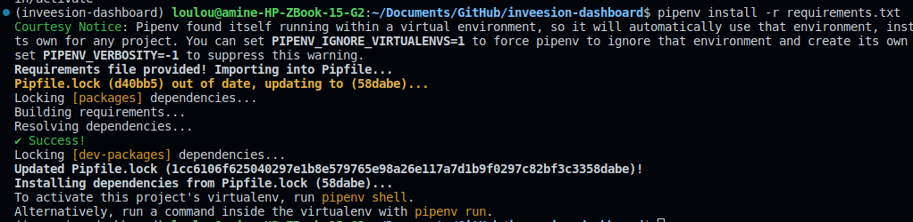
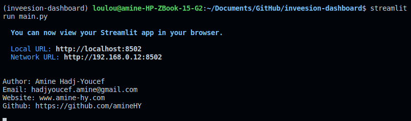
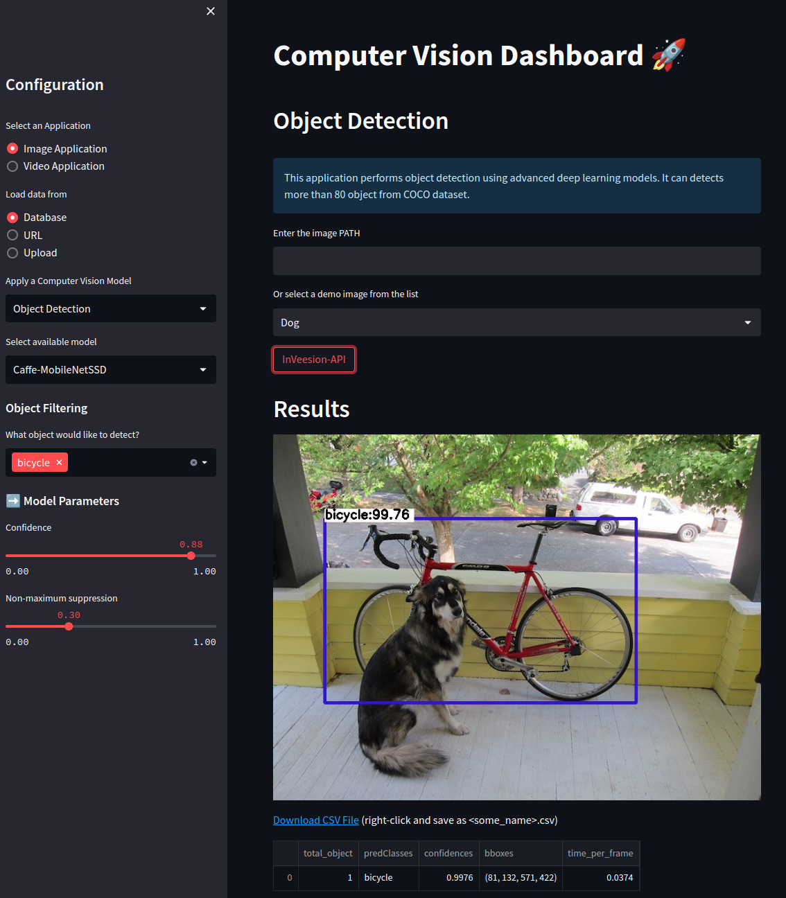
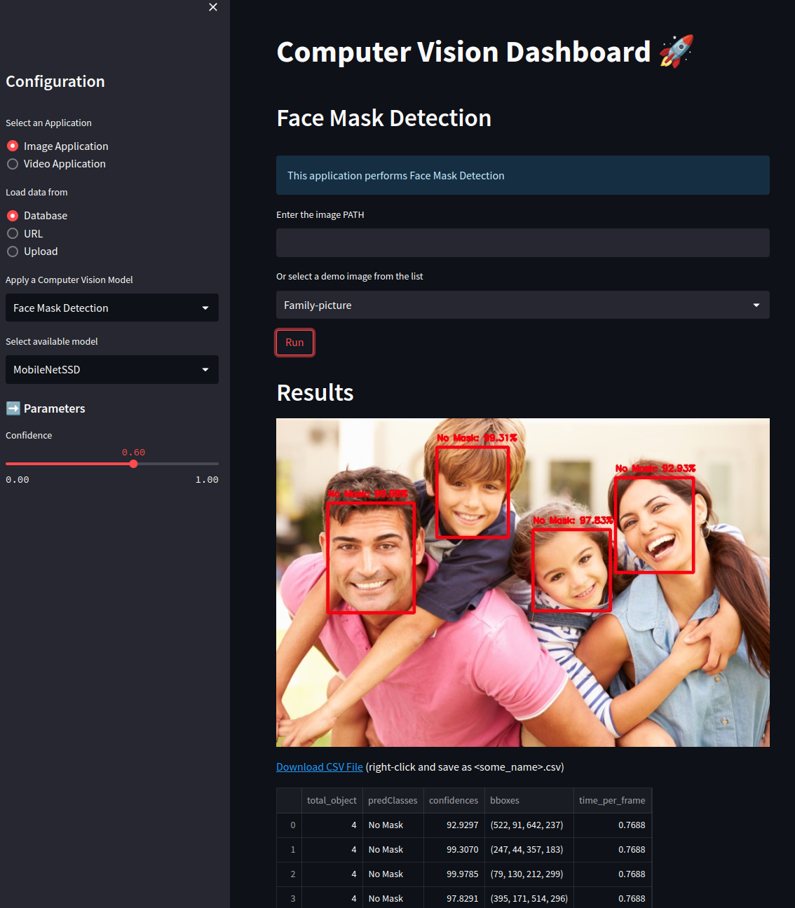
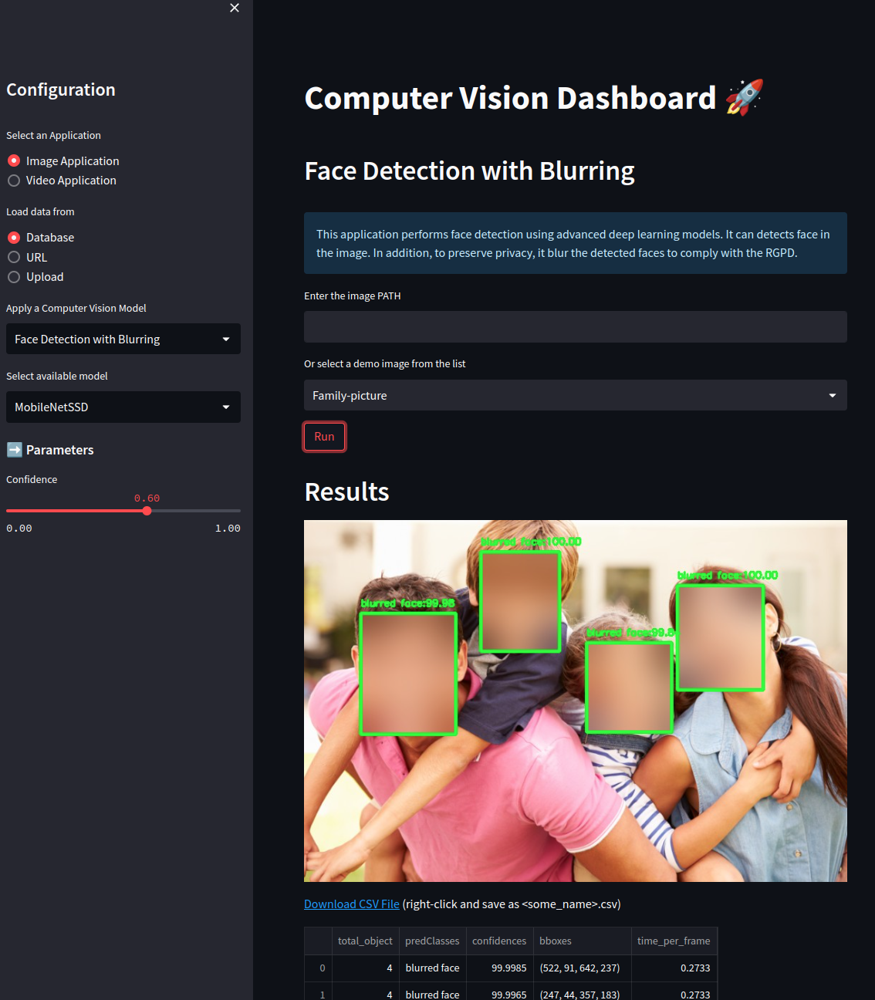
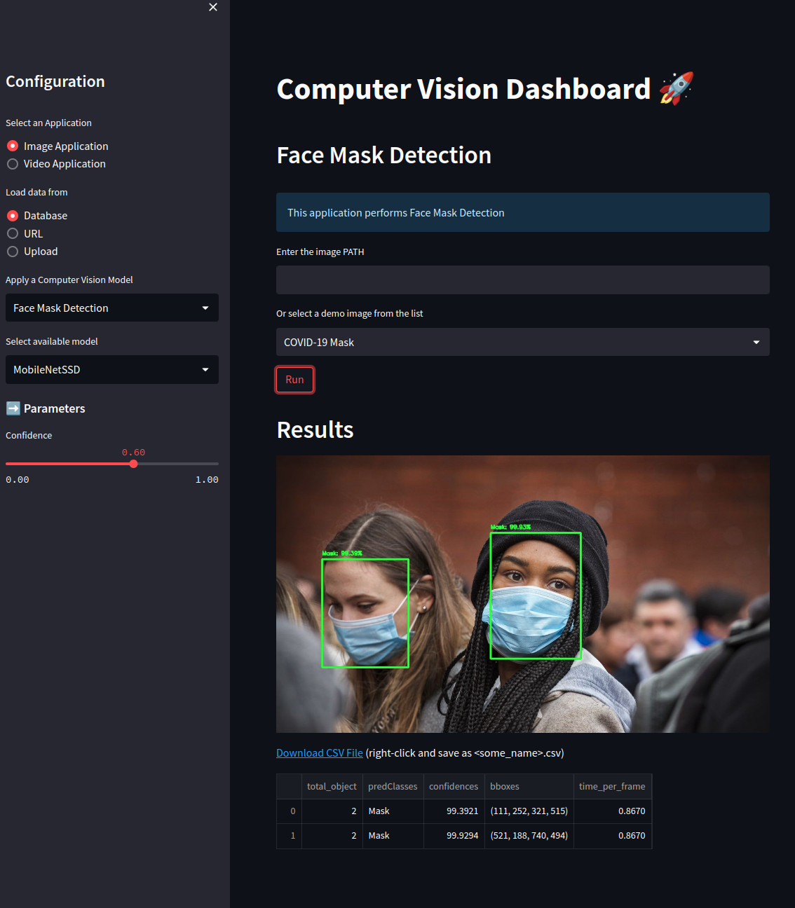

# :rocket: Computer Vision Dashboard :rocket:

## Create and activate Python virtual env

- Create a python virtual environnement using `requirements.txt`
    ```
    pipenv install -r requirements.txt
    ```
    Note the path for the created folder `venv_folder`
    

- Activate the environnement
    ```
    source venv_folder/bin/activate
    ```
    or 
    ```
    pipenv shell
    ```


## Launch the Dashboard
- First run this command from the terminal
```
streamlit run main.py
```


- Click on this adresse to open the dashboard on the browser

```
Local URL: http://localhost:8502
```


## Demo

### Video
 - Object Detection
  
  
 - Heatmap Motion Detection
  


### Image Applications
- Object detection
  
- Face detection
  
- Face detection with blurring
  

- Face Mask Detection
 


