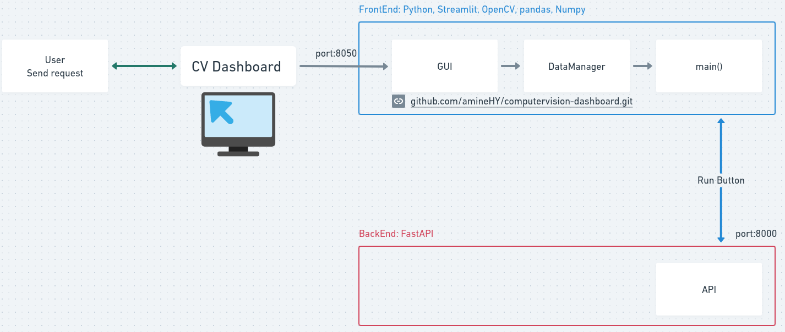
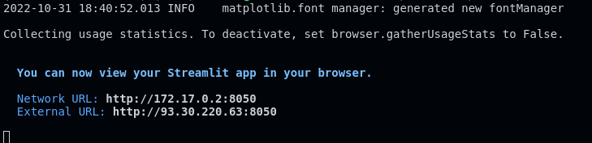

- [:rocket: Computer Vision Dashboard :rocket:](#rocket-computer-vision-dashboard-rocket)
  - [GitHub URL](#github-url)
  - [TODO](#todo)
  - [Features](#features)
  - [Architecture](#architecture)
  - [Demo](#demo)
    - [Video Applications](#video-applications)
    - [Image Applications](#image-applications)
  - [Launch the Dashboard](#launch-the-dashboard)
    - [Run the dashboard from source](#run-the-dashboard-from-source)
      - [Prepare Python virtual environnement](#prepare-python-virtual-environnement)
      - [Run the dashboard](#run-the-dashboard)
    - [Run the dashboard from docker](#run-the-dashboard-from-docker)
      - [Build the docker image](#build-the-docker-image)
      - [Run the dashboard](#run-the-dashboard-1)

# :rocket: Computer Vision Dashboard :rocket:

---

## GitHub URL

https://github.com/amineHY/computervision-dashboard.git

## TODO

- Redis : Database
- Think about a usecase
- Update the GIFs


---

## Features

- Apply Deep learning models for Computer Vision
- Support for images and videos
- Loading data from different source: local, web (URL), upload
- It is designer with a modular architecture, where each app is a class
- Export Analytics KPI to a CSV file
- Display Analytics
- Backend and Frontend separated and shipped in their respective docker image
- Librairies: OpenCV, Python, pandas, Tensorflow, Streamlit
  - Frontend developed with python and streamlit
  - Backend developed in python with FastAPI, OpenCV, Tensorflow...

---

## Architecture

Add and image architecture HERE



---

## Demo

### Video Applications

- Object Detection
  

- Heatmap Motion Detection
  

---

### Image Applications

- Object detection
  
- Face detection
  
- Face detection with blurring
  

- Face Mask Detection
  

---

## Launch the Dashboard

### Run the dashboard from source

#### Prepare Python virtual environnement

- Create a python virtual environnement using `requirements.txt`

  ```
  pipenv install -r requirements.txt
  ```

  Note the path for the created folder `venv_folder`
  

- Activate the environnement
  ```
  source venv_folder/bin/activate
  ```
  or
  ```
  pipenv shell
  ```

#### Run the dashboard

- First run this command from the terminal

  ```
  streamlit run main.py
  ```

  

- Click on this adresse to open the dashboard on the browser

  ```
  Local URL: http://localhost:8502
  ```

  

---

### Run the dashboard from docker

#### Build the docker image

```
docker build -t computervision_dashboard .
```

#### Run the dashboard

```
docker run -it --rm computervision_dashboard:latest streamlit run main.py --server.port 8050
```



---
